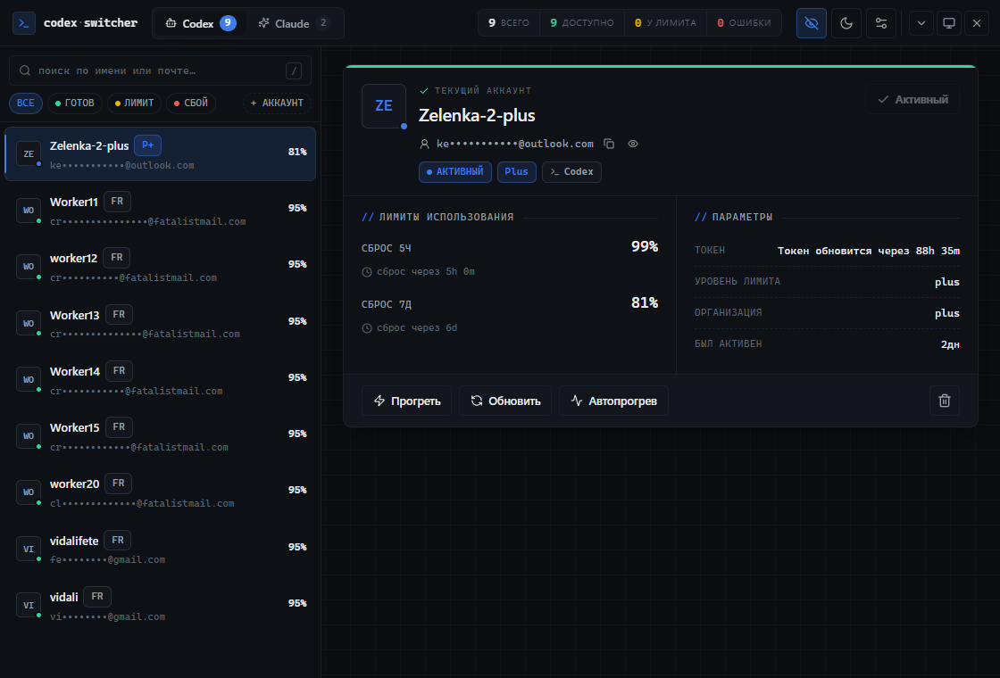

# Codex Switcher

Unofficial desktop app for switching between multiple local Codex / ChatGPT and Claude Code account profiles.

The app keeps account metadata and cached usage locally, writes the selected profile to the active auth file, and helps track 5-hour and weekly usage windows. Built as a Tauri desktop app for Windows, macOS, and Linux.

## Screenshots



## What it does

- Adds Codex accounts via ChatGPT OAuth or by importing an existing `auth.json`.
- Adds Claude accounts by importing an existing `.credentials.json`.
- Switches the active Codex account — terminates running Codex processes and restarts them with the new credentials.
- Writes Claude credentials to `~/.claude/.credentials.json` (restart Claude Code CLI to apply).
- Shows cached limit usage for Free, Plus, Pro, and Team-style Codex accounts.
- Tracks 5-hour and 7-day reset windows with progress bars.
- Global email hide toggle in the top bar — one click masks all account emails at once.
- Russian/English UI, system/manual theme selection, six accent color presets, density modes.
- Checks GitHub releases for signed app updates.
- Minimizes to the system tray; active account switchable directly from the tray menu.
- Encrypted full backup (`.cswf`) and slim text import/export.

## What it is not

- Not an official OpenAI, Codex, or Anthropic project.
- Not meant for account sharing, resale, pooling, or bypassing terms of service.
- Does not create extra quota — only displays locally cached usage data and switches between accounts you already own.
- The optional browser/LAN server exists for development and local debugging only.

## Build from source

Prerequisites: Node.js 20+, pnpm, Rust stable.

```bash
git clone https://github.com/Kevanko/codex-switcher-fork.git
cd codex-switcher-fork

pnpm install
pnpm tauri dev
```

Build installers:

```bash
pnpm tauri build
```

Bundles are written to `src-tauri/target/release/bundle/`.

## Release

The release helper keeps `package.json`, `src-tauri/tauri.conf.json`, `src-tauri/Cargo.toml`, and `src-tauri/Cargo.lock` on the same version.

```bash
pnpm version:patch
pnpm release:patch -- --push
```

GitHub Actions builds release assets from tags like `v0.2.14`. The updater reads:

```
https://github.com/Kevanko/codex-switcher-fork/releases/latest/download/latest.json
```

## Local data

Account storage lives in the user's local profile. The app reads and writes the normal Codex auth location (`~/.codex/auth.json`) and Claude credentials (`~/.claude/.credentials.json`) so the selected account is picked up by each CLI tool.

Full backups use the app's encrypted `.cswf` format. Slim import/export is for non-secret account metadata only.

## Disclaimer

Use this only with accounts you personally control. You are responsible for following OpenAI's, ChatGPT's, and Anthropic's terms. This project does not grant permission to share accounts or automate quota abuse.
